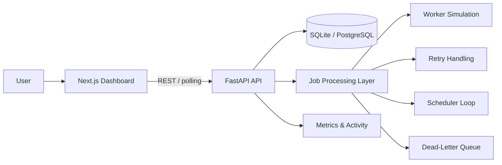
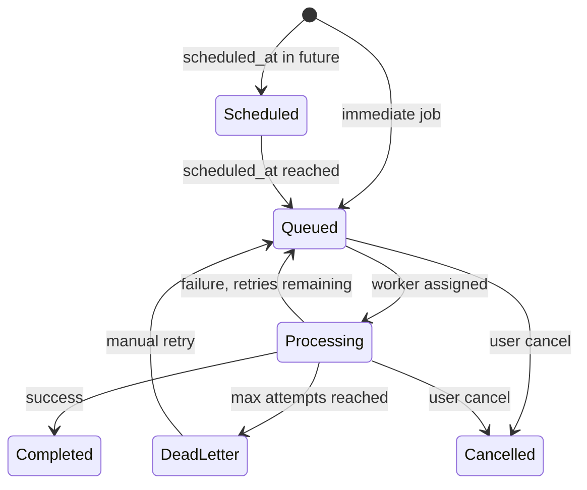

# TaskForge

**Distributed job processing, built for reliability.**

TaskForge is a full-stack developer-tool project for creating, scheduling, monitoring, retrying, and inspecting background jobs through a modern dashboard.

TaskForge is a portfolio implementation of distributed job-processing concepts. The current version uses a lightweight FastAPI processing layer and simulated worker state to keep the project easy to run while still demonstrating queues, retries, scheduling, monitoring, and dead-letter handling.

## Demo

**Live Demo:** [https://taskforge.shivadhar.com](https://taskforge.shivadhar.com)

> If the live deployment is not yet configured, run the project locally using the instructions below.

## Screenshots

| Dashboard | Jobs |
|-----------|------|
|  |  |

| Job details | Workers |
|-------------|---------|
|  |  |

Screenshots are stored in [`docs/images/`](docs/images/). Add PNG captures of the running application to that folder to populate the README preview.

## What TaskForge Demonstrates

- **Background job processing** — jobs are created via API, queued, and processed asynchronously
- **Asynchronous execution** — an in-process scheduler picks up work without blocking API requests
- **Priority queues** — critical, high, normal, and low priority ordering
- **Job lifecycle management** — queued → processing → completed, with cancellation support
- **Retry handling** — failed jobs re-enter the queue until `max_attempts` is reached
- **Scheduled execution** — jobs with a future `scheduled_at` wait until their run time
- **Dead-letter handling** — permanently failing jobs are isolated for inspection
- **Worker monitoring** — simulated worker identities reflect real assignment state
- **Execution timelines** — per-job events, logs, and attempt history
- **System activity** — a unified feed of job and worker events
- **Metrics and observability** — status distribution, queue depth, and throughput charts
- **Frontend/backend integration** — Next.js dashboard consuming a FastAPI REST API

## Features

### Job Management

Create and inspect background jobs. Each job has a predefined task type, validated payload, priority, queue, and retry configuration.

### Priority Queues

Assign jobs different processing priorities. The scheduler processes higher-priority work first.

### Scheduled Jobs

Schedule jobs for future execution. Jobs remain in `scheduled` status until their `scheduled_at` time arrives.

### Retry Handling

Failed jobs automatically re-enter the queue. Attempt count and max attempts are tracked per job.

### Dead-Letter Queue

Jobs that exceed their retry limit move to `dead_letter` status for manual inspection and retry.

### Worker Monitoring

View worker state, current assignments, throughput, and heartbeat information. Workers are simulated but tied to actual job processing.

### Execution Timeline

See how a job moved through its lifecycle — creation, queuing, worker pickup, processing, retries, and completion.

### Dashboard Analytics

View job volume, status distribution, queue health, and runtime metrics with interactive charts.

## Architecture



| Component | Role |
|-----------|------|
| **Next.js Dashboard** | Landing page, authentication, and monitoring UI |
| **FastAPI API** | REST endpoints for jobs, workers, queues, metrics, and activity |
| **Database** | SQLAlchemy ORM with SQLite locally; PostgreSQL via `DATABASE_URL` |
| **Job Processing Layer** | Async scheduler loop that dequeues and executes jobs |
| **Worker Simulation** | Six predefined worker identities assigned to running jobs |
| **Scheduler** | Promotes scheduled jobs to queued; processes queue every second |
| **Retry Handling** | Re-queues failed jobs or moves them to dead-letter |
| **Metrics & Activity** | Aggregated dashboard data and event feed |

See [docs/ARCHITECTURE.md](docs/ARCHITECTURE.md) for a deeper technical breakdown.

## Job Lifecycle



Statuses in code: `queued`, `scheduled`, `processing`, `retrying`, `completed`, `failed`, `dead_letter`, `cancelled`.

## Tech Stack

**Frontend**

- Next.js
- TypeScript
- Tailwind CSS
- shadcn/ui
- Recharts

**Backend**

- Python
- FastAPI
- SQLAlchemy

**Database**

- SQLite locally
- PostgreSQL-compatible production configuration via `DATABASE_URL`

**Testing**

- pytest

**Infrastructure**

- Docker
- GitHub Actions

## Project Structure

```
task-forge/
├── frontend/              # Next.js app (landing + dashboard)
│   ├── src/app/           # Pages and routing
│   ├── src/components/    # UI components
│   └── src/lib/           # API client and utilities
├── backend/
│   ├── app/               # FastAPI application
│   │   ├── routes.py      # API endpoints
│   │   ├── models.py      # SQLAlchemy models
│   │   ├── schemas.py     # Pydantic validation
│   │   └── services/      # Job processing logic
│   └── tests/             # API test suite
├── docs/
│   ├── ARCHITECTURE.md
│   ├── DEPLOYMENT.md
│   └── images/            # README screenshots
├── .github/workflows/     # CI pipeline
├── docker-compose.yml
├── .env.example
└── README.md
```

## Local Development

### Prerequisites

- Node.js 20+
- Python 3.12+
- npm

### Backend

```bash
cd backend

python -m venv .venv
source .venv/bin/activate   # Windows: .venv\Scripts\activate

pip install -r requirements.txt

uvicorn app.main:app --reload --port 8000
```

- API: [http://localhost:8000](http://localhost:8000)
- Swagger docs: [http://localhost:8000/docs](http://localhost:8000/docs)

The API seeds demo data on first startup.

### Frontend

```bash
cd frontend

cp ../.env.example .env.local
npm install
npm run dev
```

- Frontend: [http://localhost:3000](http://localhost:3000)

### Docker

```bash
docker compose up --build
```

This starts two services:

| Service | Port | Description |
|---------|------|-------------|
| `backend` | 8000 | FastAPI API with SQLite persistence |
| `frontend` | 3000 | Next.js dashboard |

## Demo Account

This application uses lightweight demo authentication for the portfolio environment.

| | |
|---|---|
| **Email** | [demo@taskforge.dev](mailto:demo@taskforge.dev) |
| **Password** | `demo123` |

Do not use this password for any real production account.

## Environment Variables

Copy `.env.example` and adjust for your environment. Never commit `.env` files.

| Variable | Description | Example |
|----------|-------------|---------|
| `DATABASE_URL` | Database connection string | `sqlite:///./taskforge.db` |
| `CORS_ORIGINS` | Allowed CORS origins (comma-separated) | `http://localhost:3000` |
| `ENVIRONMENT` | Runtime environment | `development` |
| `NEXT_PUBLIC_API_URL` | Backend URL for the frontend | `http://localhost:8000` |
| `NEXT_PUBLIC_SITE_URL` | Public site URL for metadata | `http://localhost:3000` |

## API

| Method | Endpoint | Description |
|--------|----------|-------------|
| `GET` | `/api/health` | Health check |
| `GET` | `/api/jobs` | List jobs (with filters) |
| `POST` | `/api/jobs` | Create a job |
| `GET` | `/api/jobs/{id}` | Job details with events, logs, attempts |
| `POST` | `/api/jobs/{id}/retry` | Retry a failed or dead-letter job |
| `POST` | `/api/jobs/{id}/cancel` | Cancel a job |
| `DELETE` | `/api/jobs/{id}` | Delete a job |
| `GET` | `/api/workers` | List workers |
| `GET` | `/api/queues` | Queue statistics |
| `GET` | `/api/activity` | Activity feed |
| `GET` | `/api/metrics` | Dashboard metrics |
| `GET` | `/api/scheduled` | Scheduled jobs |
| `GET` | `/api/dead-letter` | Dead-letter jobs |

Interactive API documentation is available at `/docs` when the backend is running.

### Allowed Task Types

Only predefined demo tasks are accepted. Arbitrary code execution is not supported.

`generate_report`, `send_email`, `process_dataset`, `resize_image`, `sync_customer`, `export_invoice`, `send_notification`, `unstable_task`, `always_fail`

## Engineering Decisions

### Lightweight Processing

TaskForge does not require Redis, Celery, or a message broker. An async scheduler loop in the FastAPI process handles queuing and execution, making local setup a single command.

### SQLite for Local Development

SQLite requires no external database server. The SQLAlchemy layer works with both SQLite and PostgreSQL without code changes.

### PostgreSQL Compatibility

Set `DATABASE_URL` to a PostgreSQL connection string for production persistence. See [docs/DEPLOYMENT.md](docs/DEPLOYMENT.md).

### Polling Instead of WebSockets

The dashboard polls the API every 3–5 seconds for updates. This keeps the implementation simple and reliable without requiring a persistent connection layer.

### Simulated Workers

Worker monitoring demonstrates worker-state concepts — assignment, busy/idle, heartbeat — without requiring separate worker processes.

### Dead-Letter Handling

Permanently failing jobs are separated from the active queue so they can be inspected, debugged, and manually retried without blocking other work.

### Predefined Tasks Only

Job payloads are validated and only whitelisted task names are executed. This prevents arbitrary code execution in public deployments.

## Current Limitations

- Workers are simulated rather than separate distributed processes
- Authentication is demo-only (localStorage, no server-side sessions)
- Queue processing is lightweight and single-node
- No multi-tenant isolation
- No production-grade authorization
- No Redis-backed distributed queue
- Concurrent processing is capped at three jobs in the scheduler loop

## Future Improvements

- Redis-backed queues
- Separate worker processes
- PostgreSQL production persistence
- WebSocket or SSE updates
- Authenticated multi-user workspaces
- Distributed worker deployment
- Advanced queue controls
- OpenTelemetry tracing

## Testing

```bash
# Backend (15 tests)
cd backend
pip install -r requirements.txt
pytest -v

# Frontend
cd frontend
npm install
npm run lint
npm run build
```

## Deployment

See [docs/DEPLOYMENT.md](docs/DEPLOYMENT.md) for Vercel (frontend) and Render/Railway (backend) instructions.

## License

MIT License. See [LICENSE](LICENSE).
